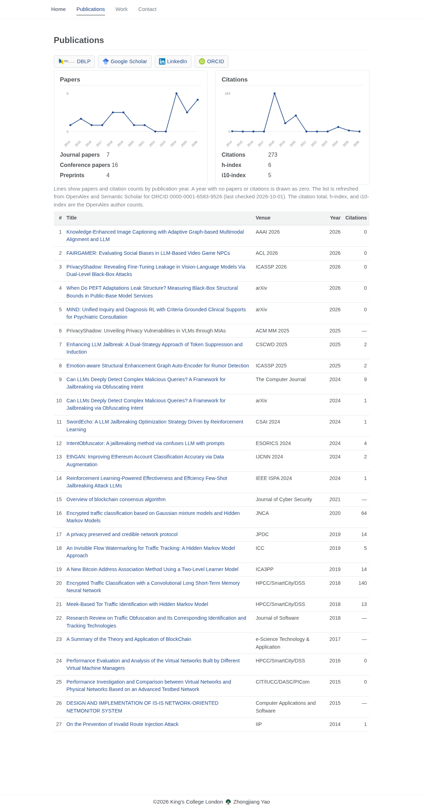
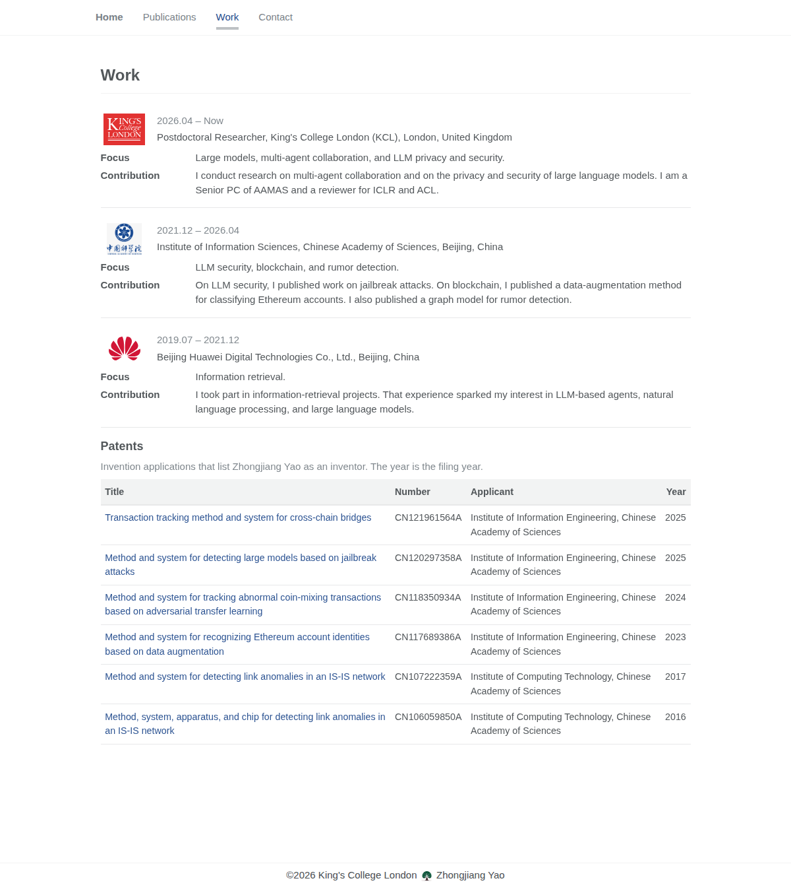
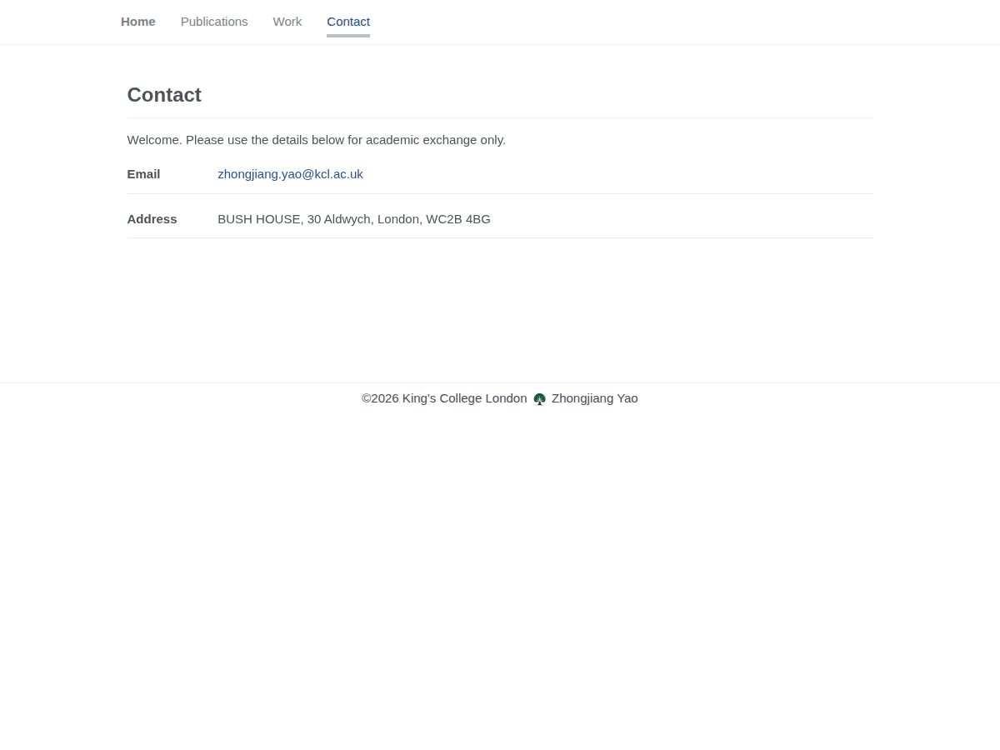

# Zhongjiang Yao

Academic homepage for Zhongjiang Yao. GitHub Pages publishes this Jekyll site from the `main` branch at [yaozhongjiang.github.io](https://yaozhongjiang.github.io/).

Every page has the same header and footer. The header links to Home, Publications, Work, and Contact. The footer reads “©2026 King's College London”, then the site icon, then “Zhongjiang Yao”.

## Home


The identity column shows the avatar (`images/yaozhongjiang.jpg`), the name Zhongjiang Yao, and King's College London underneath the name. The LinkedIn icon links directly to <https://www.linkedin.com/in/zhongjiang-yao-b0756a406/>. The ORCID icon links directly to <https://orcid.org/0000-0001-6583-9526>.

The biography states that he is a postdoctoral researcher at King's College London working on multi-agent collaboration and LLM security; that his Ph.D. is from the University of Chinese Academy of Sciences, on network traffic identification and tracking; that he later worked at Huawei on information retrieval and moved from that into natural language processing and large language models; and that he has published more than ten papers on deep learning and large language models, is a Senior PC of AAMAS, and is a reviewer for ICLR and ACL.

The research fields on the page are Multi Agent Collaboration, LLM privacy and security, Natural Language Processing, Blockchain, and Traffic Analysis.

**Recent activities** come from `_data/activities.yml`, in this order:

- 24–25 Nov 2026 — UKAIRS 26, organized by the University of Edinburgh
- 19 Oct 2026 — Olympia AI Live
- 5–9 Oct 2026 — attended Oxford University BOLD Collaboration Week and organized the Multi-agent Distributed Security Workshop
- 10 Sep 2026 — attended UCL SOFAIR Launch Event
- 3 Aug 2026 — attended Oxford University BOLD

A green check is drawn when the item is marked `done: true`, or when its end date is before the day the page is opened. The 5–9 Oct 2026 BOLD week item is marked done, so it has a check. In the screenshot above, taken on 8 Oct 2026, the 10 Sep and 3 Aug items also have checks, and the November and 19 Oct items do not.

**Recently published papers** includes a paper only when its year is the latest year in `_data/publications.yml`. That year is 2026. Each row shows the year and the title, linked to the paper:

- Knowledge-Enhanced Image Captioning with Adaptive Graph-based Multimodal Alignment and LLM
- FAIRGAMER: Evaluating Social Biases in LLM-Based Video Game NPCs
- PrivacyShadow: Revealing Fine-Tuning Leakage in Vision-Language Models Via Dual-Level Black-Box Attacks
- When Do PEFT Adaptations Leak Structure? Measuring Black-Box Structural Bounds in Public-Base Model Services
- MIND: Unified Inquiry and Diagnosis RL with Criteria Grounded Clinical Supports for Psychiatric Consultation

## Publications



The profile links are [DBLP](https://dblp.org/pid/152/5483.html), [Google Scholar](https://scholar.google.com/citations?user=mNQ2160AAAAJ), [LinkedIn](https://www.linkedin.com/in/zhongjiang-yao-b0756a406/), and [ORCID](https://orcid.org/0000-0001-6583-9526). LinkedIn uses the same direct profile URL as on Home.

The Papers and Citations panels are line charts of counts by publication year, from 2014 through 2026. A year with no papers or citations is drawn as zero. Next to the charts the page shows 7 journal papers, 16 conference papers, 4 preprints, 273 citations, an h-index of 6, and an i10-index of 5. The citation total, h-index, and i10-index are the OpenAlex author counts. The note under the charts says the list is refreshed from OpenAlex and Semantic Scholar for ORCID 0000-0001-6583-9526, last checked 2026-10-01.

The table lists every paper in `_data/publications.yml`. The columns are number, title, venue, year, and citations. A title links to that paper’s URL.

## Work



Each role shows its logo, dates, and place, then a Focus line and a Contribution line:

- King's College London logo. 2026.04 – Now. Postdoctoral Researcher, King's College London (KCL), London, United Kingdom. Focus: large models, multi-agent collaboration, and LLM privacy and security. Contribution: research on multi-agent collaboration and on the privacy and security of large language models; Senior PC of AAMAS and a reviewer for ICLR and ACL.
- Chinese Academy of Sciences logo. 2021.12 – 2026.04. Institute of Information Sciences, Chinese Academy of Sciences, Beijing, China. Focus: LLM security, blockchain, and rumor detection. Contribution: published work on jailbreak attacks, a data-augmentation method for classifying Ethereum accounts, and a graph model for rumor detection.
- Huawei logo. 2019.07 – 2021.12. Beijing Huawei Digital Technologies Co., Ltd., Beijing, China. Focus: information retrieval. Contribution: information-retrieval projects that led to an interest in LLM-based agents, natural language processing, and large language models.

The Patents section says these are invention applications that list Zhongjiang Yao as an inventor, and that the year is the filing year. Titles and applicants are in English. The columns are Title, Number, Applicant, and Year, and each title links to its Google Patents page.

## Contact



The page says “Welcome. Please use the details below for academic exchange only.” It then lists the email [zhongjiang.yao@kcl.ac.uk](mailto:zhongjiang.yao@kcl.ac.uk) and the address BUSH HOUSE, 30 Aldwych, London, WC2B 4BG.

## Publication refresh

[`.github/workflows/update-publications.yml`](.github/workflows/update-publications.yml) runs [`scripts/update_publications.py`](scripts/update_publications.py) at 08:00 UTC on 1 January, 1 May, and 1 September. The workflow can also be started manually.

The script reads the ORCID URL in [`_config.yml`](_config.yml), `https://orcid.org/0000-0001-6583-9526`. It queries OpenAlex with that ORCID, then searches Semantic Scholar and keeps an author record only when one of its papers shares a DOI already returned by OpenAlex. Papers already listed in [`_data/publications.yml`](_data/publications.yml) are kept. A listed preprint is replaced when a journal or conference version of that same paper is found. Citation totals stay the OpenAlex author counts. When the data file changes, the workflow commits it.

## Local preview

The [Gemfile](Gemfile) pins `github-pages` to `~> 232`. [`run_server.sh`](run_server.sh) and [`run_server.bat`](run_server.bat) run `bundle exec jekyll serve --host 0.0.0.0 --port 4000 --livereload`.

```bash
bundle install
bash run_server.sh
```

Open [http://127.0.0.1:4000](http://127.0.0.1:4000). On Windows, run `run_server.bat`.
