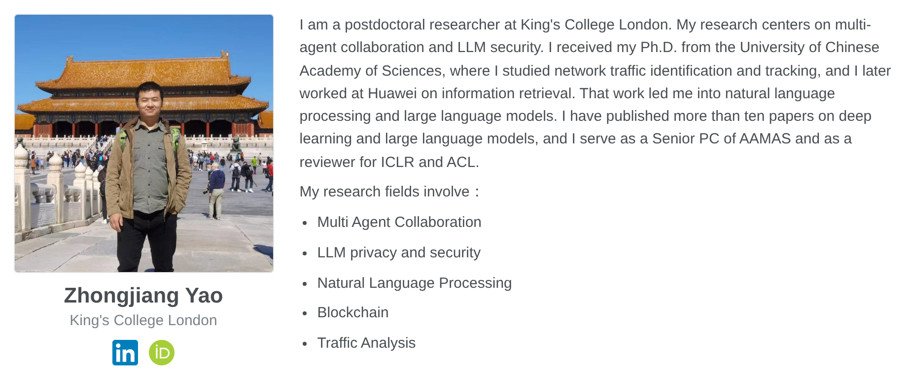

# Zhongjiang Yao

Zhongjiang Yao is a postdoctoral researcher at King's College London. The homepage is [https://yaozhongjiang.github.io/](https://yaozhongjiang.github.io/).

Home, Publications, Work, and Contact cover his biography, papers, positions and patents, and academic contact. His research is on multi-agent collaboration, LLM privacy and security, natural language processing, blockchain, and traffic analysis.

Publications refresh every four months from OpenAlex and Semantic Scholar, using the ORCID in `_config.yml`.

Preview locally with `bash run_server.sh`.
