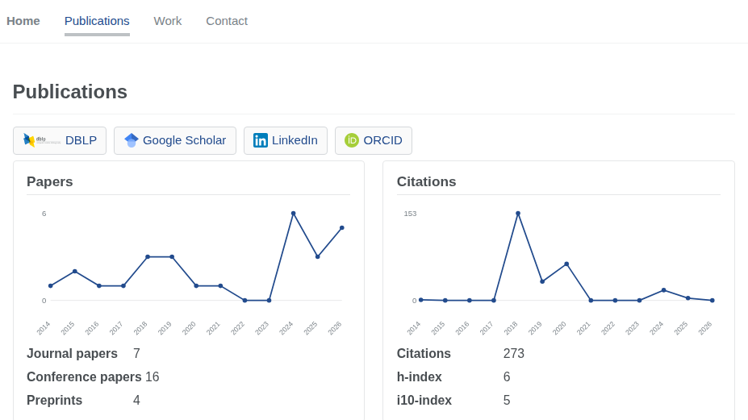

# yaozhongjiang.github.io

Academic homepage published with GitHub Pages from the `main` branch: [yaozhongjiang.github.io](https://yaozhongjiang.github.io/).

- **Home** marks finished activities with a check and lists papers from the latest publication year.
- **Publications** has profile links, publication counts, yearly charts, and the full paper list. A title links out when a URL is present.
- **Work** shows each role with a logo and a focus line, then a patent table.
- **Contact** is for academic exchange.

Publications refresh every four months from OpenAlex and Semantic Scholar, using the ORCID in `_config.yml`.

Preview locally with `bash run_server.sh`.
